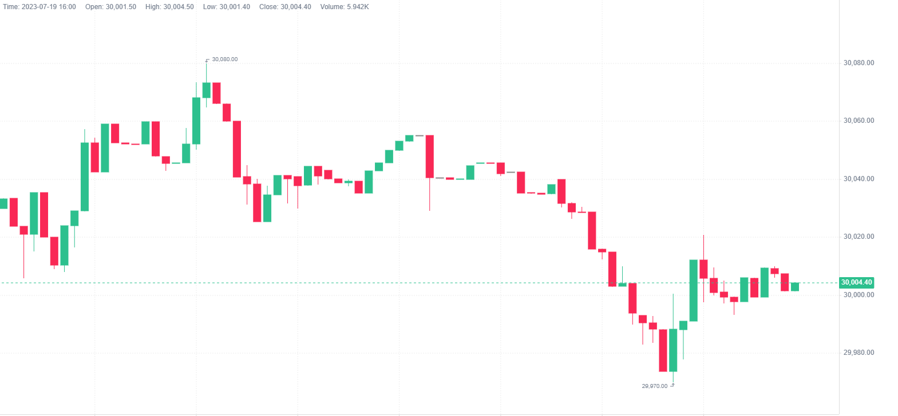

## Hades Bot

binance/okx based, currently it can only support real time Tick/Bar/Order/Position live update and monitor. In `bot/strategies/sample` , created a simple strategy, doing nothing but send notification 

## How to start

### 1. Setup Environment

```shell
python -m venv runtime
runtime\Scripts\activate
pip install -r requirements.txt
# if requirements.txt not work
pip3 install python-okx pandas websockets requests binance-futures-connector schedule "uvicorn[standard]" fastapi
```

### 2. Change Configuration

copy `example.conf` and rename to `app.conf` , change parameter

```ini
[binance]
apiKey           = apiKey
secretKey        = secretKey

[okx]
apiKey           = apiKey
secretKey        = secretKey
passphrase       = passphrase
ws_private       = wss://wsaws.okx.com:8443/ws/v5/private
ws_public        = wss://wsaws.okx.com:8443/ws/v5/public
ws_business      = wss://wsaws.okx.com:8443/ws/v5/business
domain           = https://aws.okx.com
useServerTime    = False

[notification]
token            = token
prefix           = prefix
period           = 8-23
```

### 3. Strategy
implement your own Strategy (extends Strategy) and replace the strategy in `main.py`

```shell
python main.py
```

### 4. Deploy to PROD

#### 4.1 Create /app and execute git clone

```shell
sudo -s
mkdir /app
chown user:user /app
cd /app
git clone git@github.com:Icefoxes/trading-bot.git .
```
#### 4.2 setup supervisor

```shell
pip3 install supervisor
echo_supervisord_conf > /etc/supervisord.conf
echo bot.ini >> /etc/supervisord.conf
supervisord -c /etc/supervisord.conf
supervisorctl start bot
```

## Planned feature
- backtesting
- ui to show backtesting
